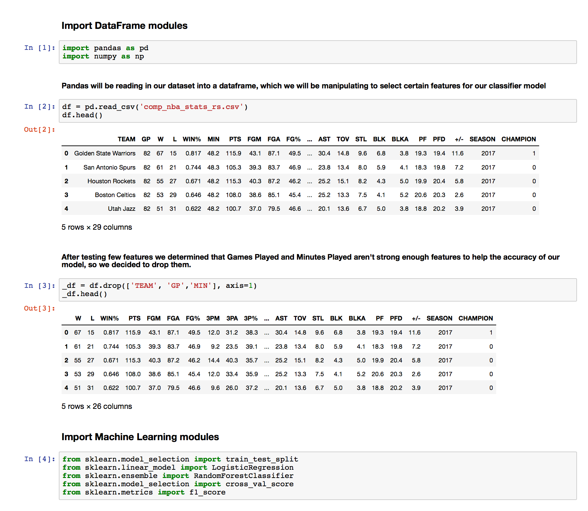
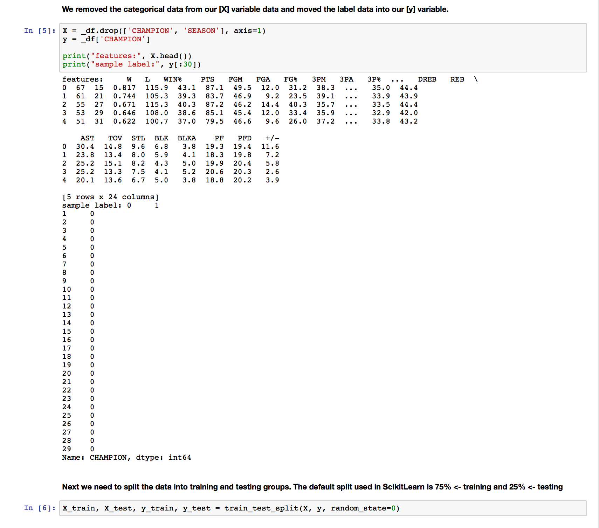
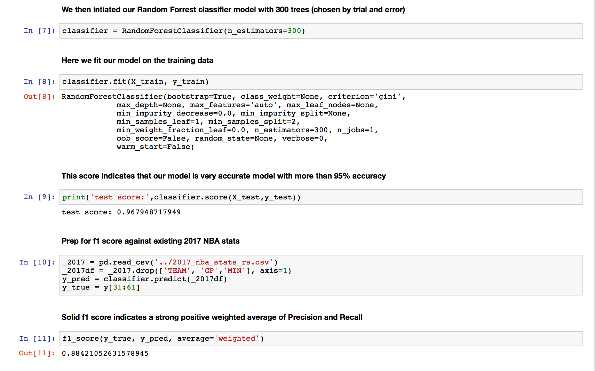
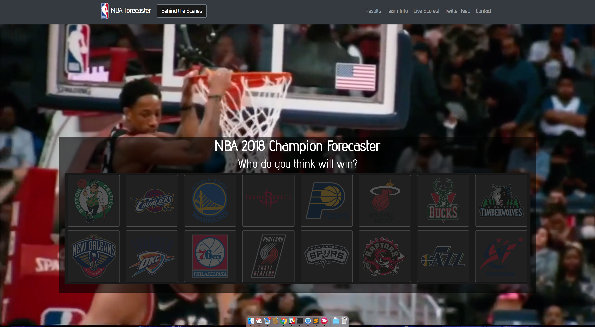
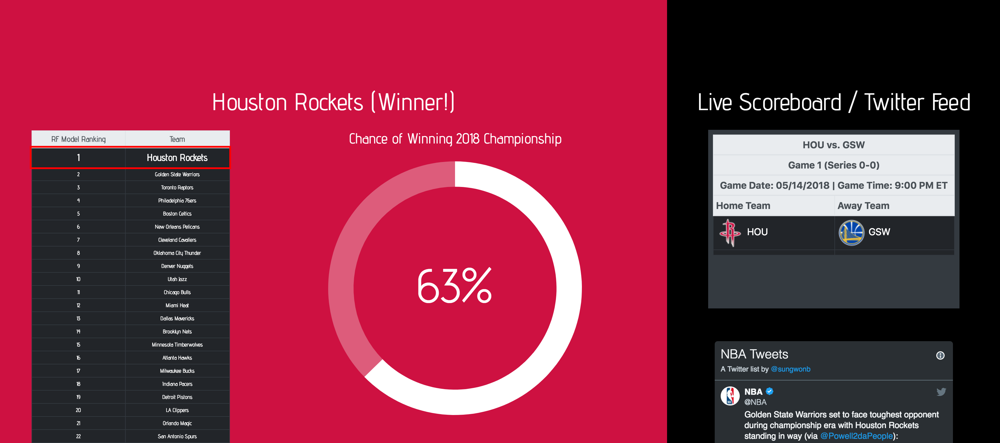
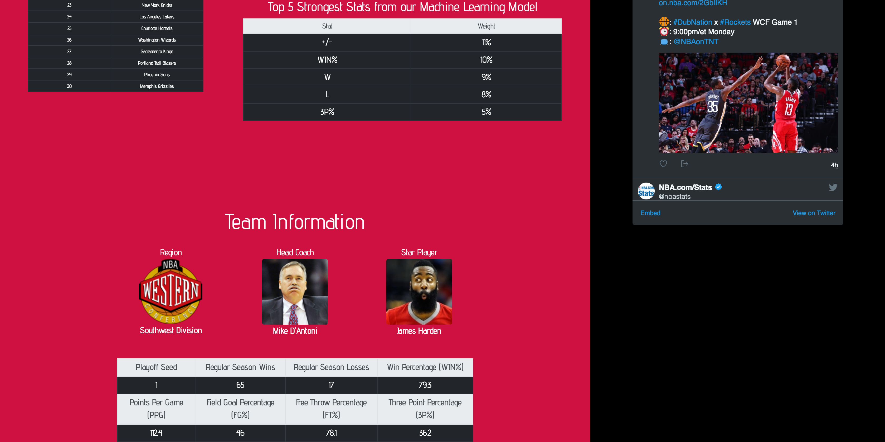
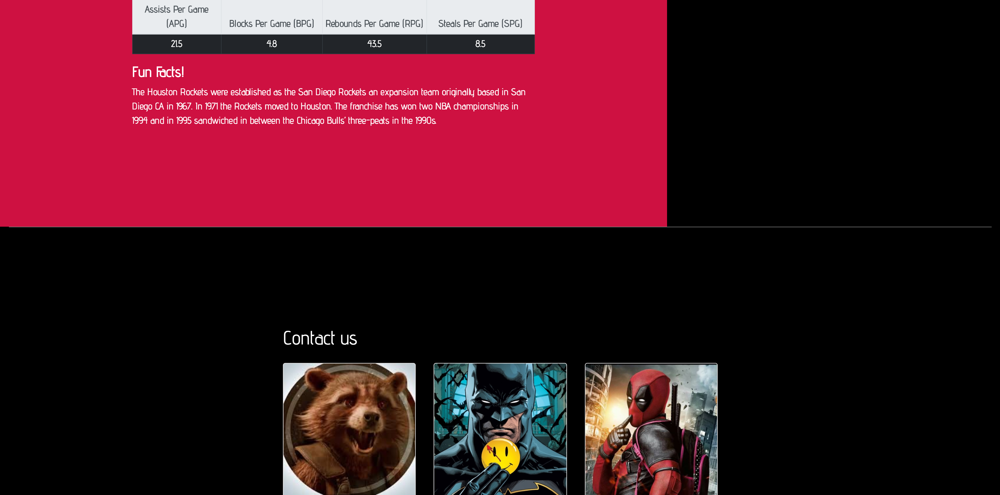

## NBA Champion Forecaster

    

# Objective

Predict the NBA Championship Team for 2018 using a fine tuned Deep Learning Algorithm, and project it to the user on an easily digestable UI web application.

# Background

[NBA Stats info and years the data is collected]

## Step 1 - Data Gathering and Cleaning

* Data was collected from <a href="https://stats.nba.com/">stats.nba.com</a>
* The endpoint http://data.nba.net/10s/prod/v1/{today}/scoreboard.json
* Engineered a SqlLite data file with playoff team stats and historical information

## Step 2 - ML Model Build

We tested various ML algorithms for best fit. Random Forests proved to be the best model for this type of classification problem. Below are our Jupyter Notebook coding blocks showing the how we produced our model and the metrics that show the strength in fit.

    

    

    

## Step 3 - Flask

Used various

## Step 4 - Application Build

# Sample Web-app

